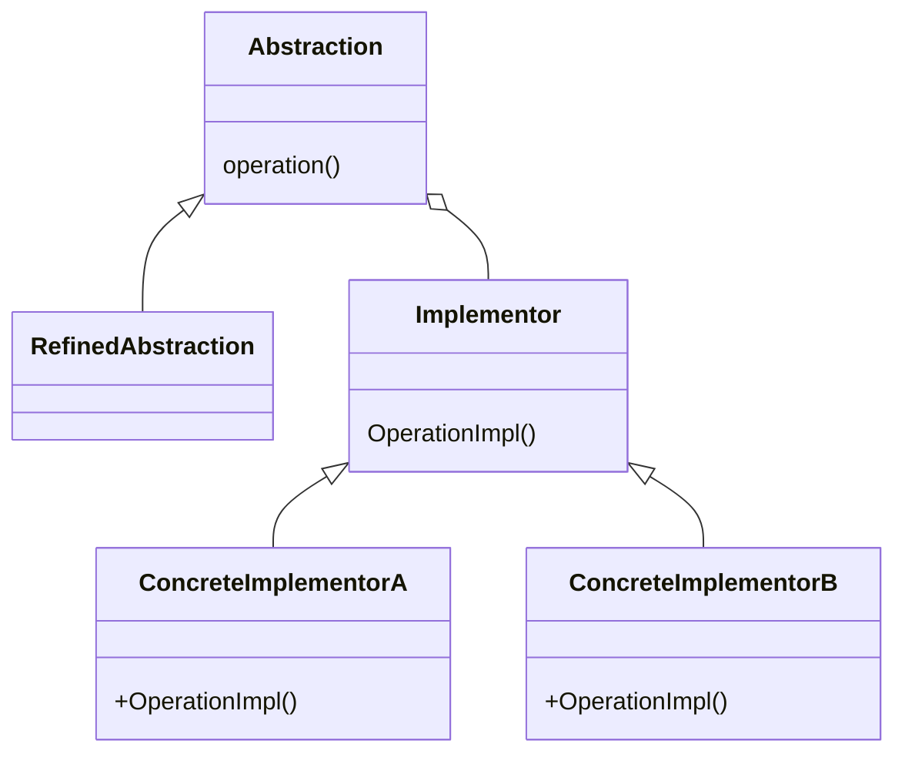
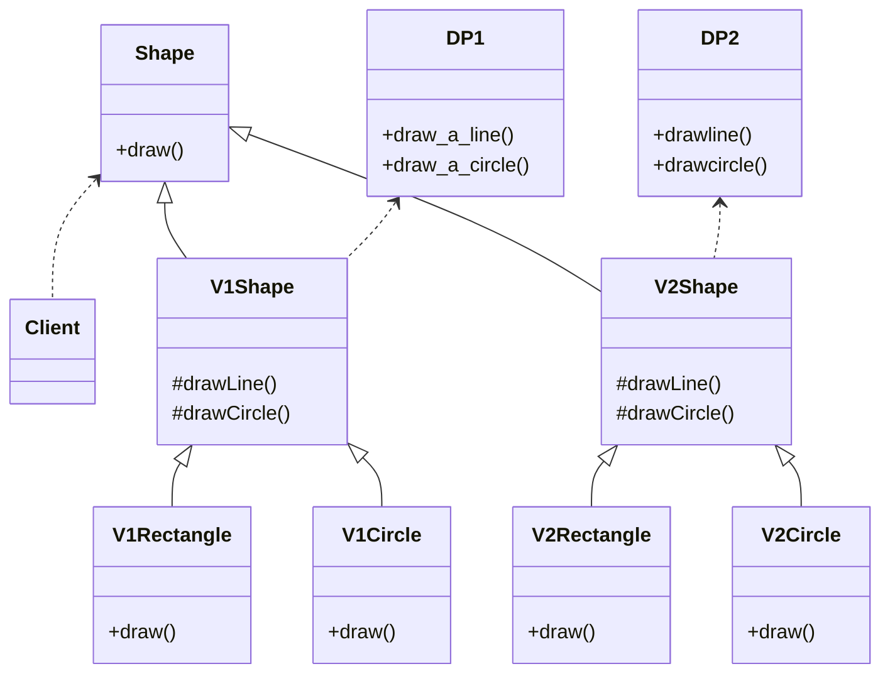
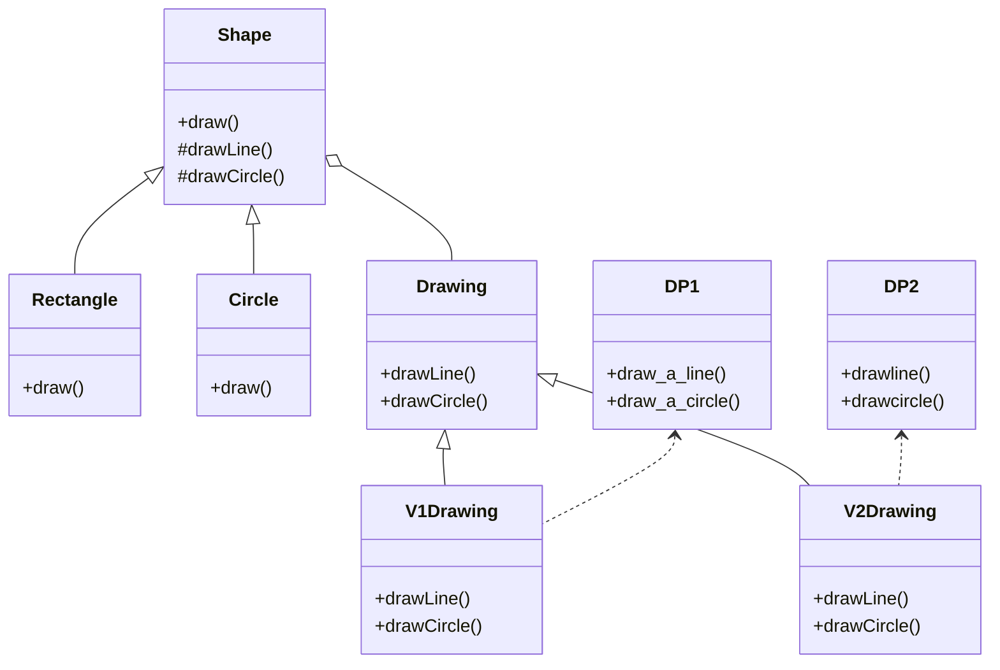

# Bridgeパターン

## Bridgeパターンとは
- 実装から抽象的側面を切り出して、それらを独立して変更できるようにする

|    |    |
| ---- | ---- |
| 目的 | 実装を使用しているオブジェクト群から、その一連の実装を切り離す |
| 問題|  クラス数の爆発を招くことなく、抽象クラスの派生物から複数の実装を使用する必要がある |
| 解決策 | 使用する全ての実装のインターフェースを定義し、抽象クラスの派生物からそれを使用する |
| 構成要素と協調要素| Abstractionは実装されるオブジェクトのためのインターフェースを定義する。Implementorは特定実装クラスのインターフェースを定義する。Abstractionから派生したクラス(RefinedAbstraction)は、Implementorから派生したクラスがどの具体的なConcreteImplementorであるかを知ることなくそれを使用する
| 因果関係 | オブジェクトが使用している実装を、そのオブジェクトから切り離すことによって拡張性を高める。クライアントオブジェクトは実装に関するあれこれを気にする必要がなくなる |
| 実装 | 抽象クラス内に実装をカプセル化する。実装を行う抽象的側面の基底クラス内にそのハンドルを保持する |

---
## 具体例
- ある形状を描画するシステムを考える
- 形状の種類と描画方法が流動的要素になる
    - 四角を描画
    - 丸を描画...など

### 継承を使ったアプローチ
- 形状や描画方法が増えるたびに組み合わせ(クラス数)が指数的に増える

### Bridgeパターンのアプローチ
- 形状の抽象的側面(Shapeクラスの抽象的側面)と描画の実装(Drawingの実装)を切り離している
- 実装をオブジェクトから使用するものという観点に立つことで、実装における流動的要素を隠蔽できる

## メモ
- Bridgeパターンを設計する際は抽象的側面を表す部分(派生クラスを含む)と実装を表す部分を心に留めること