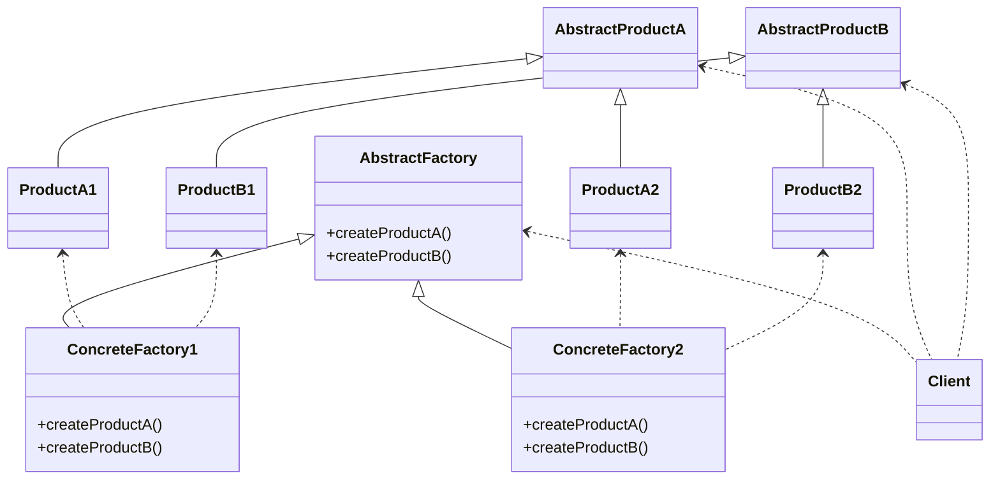
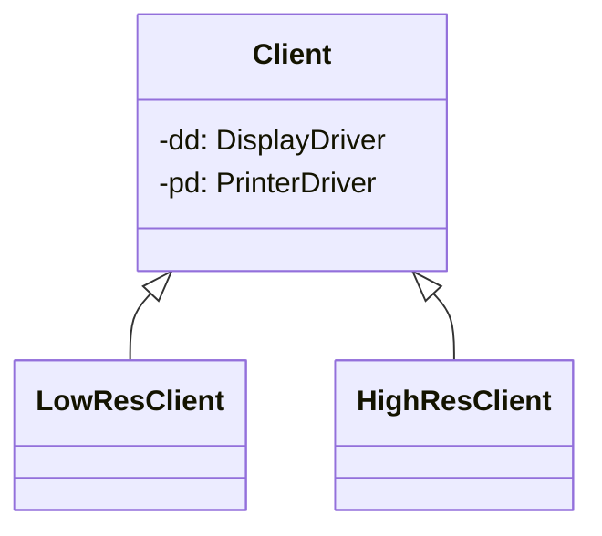
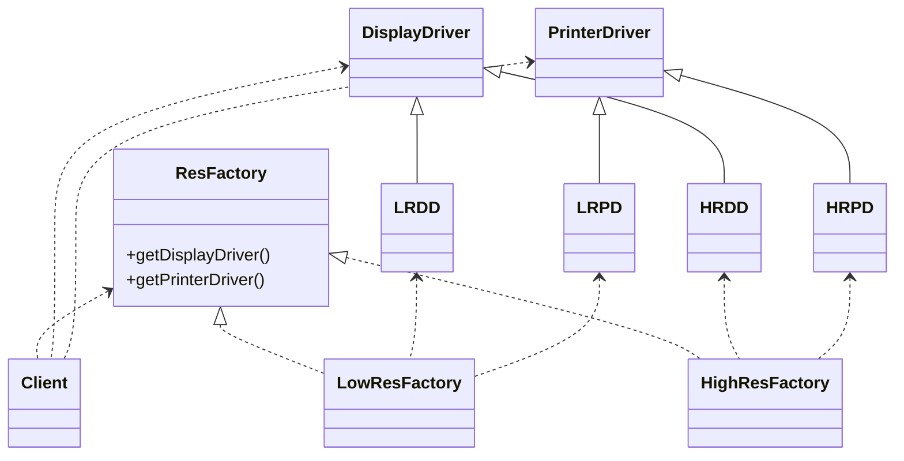
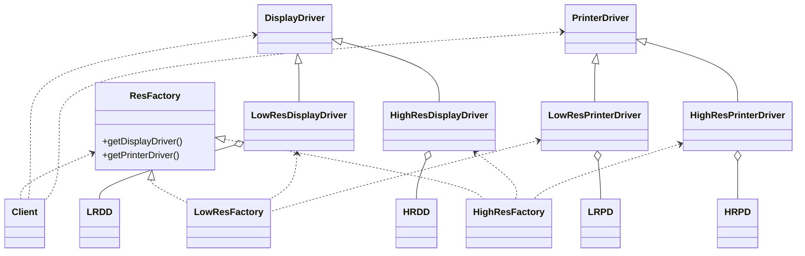

# Abstract Factoryパターン

## Abstract Factoryとは
- 関連または依存し合うオブジェクトのファミリを、その具象クラスを指定することなしに生成するインターフェースを提供する

|    |    |
| ---- | ---- |
| 目的 | 特定のクライアント(または状況)に対するオブジェクトのファミリやセットを用意する |
| 問題|  関連のあるオブジェクトのファミリを実体化する必要がある |
| 解決策 | オブジェクトのファミリを生成する。クライアントオブジェクトが使用するオブジェクト群の実体化方法に関する規則をその使用から切り離す |
| 構成要素と協調要素| AbstractFactory内に、オブジェクトのファミリを構成するメンバの生成要求インターフェースを定義する。通常の場合、各ファミリは専用のConcreteFactoryNによって生成される
| 因果関係 | このパターンにより、どのオブジェクトを使用するのかという規則とそれらのオブジェクトの使用方法に関するロジックを分離することができる
| 実装 | 抽象クラスを定義し、作成対象オブジェクト群を規定する。その後、各ファミリ毎に具象クラスを実装する。テーブルやファイルを使用することで、同じことを実現することもできる

---

![](https://mermaid.ink/img/eyJjb2RlIjoiY2xhc3NEaWFncmFtXG5cbiAgICBBYnN0cmFjdEZhY3RvcnkgPHwtLSBDb25jcmV0ZUZhY3RvcnkxXG4gICAgQWJzdHJhY3RGYWN0b3J5IDx8LS0gQ29uY3JldGVGYWN0b3J5MlxuXG4gICAgQWJzdHJhY3RQcm9kdWN0QSA8fC0tIFByb2R1Y3RBMVxuICAgIEFic3RyYWN0UHJvZHVjdEEgPHwtLSBQcm9kdWN0QTJcbiAgICBcbiAgICBBYnN0cmFjdFByb2R1Y3RCIDx8LS0gUHJvZHVjdEIxXG4gICAgQWJzdHJhY3RQcm9kdWN0QiA8fC0tIFByb2R1Y3RCMlxuXG4gICAgQWJzdHJhY3RGYWN0b3J5IDwuLiBDbGllbnRcbiAgICBBYnN0cmFjdFByb2R1Y3RBIDwuLiBDbGllbnRcbiAgICBBYnN0cmFjdFByb2R1Y3RCIDwuLiBDbGllbnRcblxuICAgIFByb2R1Y3RBMSA8Li4gQ29uY3JldGVGYWN0b3J5MVxuICAgIFByb2R1Y3RCMSA8Li4gQ29uY3JldGVGYWN0b3J5MVxuXG4gICAgUHJvZHVjdEEyIDwuLiBDb25jcmV0ZUZhY3RvcnkyXG4gICAgUHJvZHVjdEIyIDwuLiBDb25jcmV0ZUZhY3RvcnkyXG5cbiAgICBjbGFzcyBDbGllbnRcbiAgICBjbGFzcyBBYnN0cmFjdEZhY3Rvcnkge1xuICAgICAgICArY3JlYXRlUHJvZHVjdEEoKVxuICAgICAgICArY3JlYXRlUHJvZHVjdEIoKVxuICAgIH1cbiAgICBjbGFzcyBDb25jcmV0ZUZhY3RvcnkxIHtcbiAgICAgICAgK2NyZWF0ZVByb2R1Y3RBKClcbiAgICAgICAgK2NyZWF0ZVByb2R1Y3RCKCkgXG4gICAgfVxuICAgIGNsYXNzIENvbmNyZXRlRmFjdG9yeTIge1xuICAgICAgICArY3JlYXRlUHJvZHVjdEEoKVxuICAgICAgICArY3JlYXRlUHJvZHVjdEIoKSBcbiAgICB9XG4gICAgY2xhc3MgQWJzdHJhY3RQcm9kdWN0QVxuICAgIGNsYXNzIFByb2R1Y3RBMVxuICAgIGNsYXNzIFByb2R1Y3RBMlxuICAgIGNsYXNzIEFic3RyYWN0UHJvZHVjdEJcbiAgICBjbGFzcyBQcm9kdWN0QjFcbiAgICBjbGFzcyBQcm9kdWN0QjIiLCJtZXJtYWlkIjp7InRoZW1lIjoiZm9yZXN0In0sInVwZGF0ZUVkaXRvciI6ZmFsc2V9)

## 例
- コンピュータのハードウェアによって、ディスプレイとプリンタのドライバを変えるような場合を考える
    - 低解像度ディスプレイドライバ、低解像度プリンタドライバ、高解像度ディスプレイドライバ、高解像度プリンタドライバ

### パターン1
- ディスプレイドライバ、プリンタドライバを使用するクライアントが`switch`などで切り変える
    - コードは雰囲気

```scala
class Client() {

    def display() {
        this.resolution match {
            case HIGH => // HRDD(高解像度ディスプレイドライバ)を使う
            case LOW =>  // LRDD(低解像度ディスプレイドライバ)を使う
        }
    }

    def print() {
        this.resolution match {
            case HIGH => // HRPD(高解像度プリンタドライバ)を使う
            case LOW => // LRPD(低解像度プリンタドライバ)を使う
        }
    }
}
```

#### 問題点
- 高結合
    - 表示・プリントを行う処理がデバイスドライバの決定を行っており、本来関係していない部分が結合している
- 低凝集
    - 解像度のルールを変更した(Middleが加わるなど)した場合、本来関係のないコードを2箇所修正する必要がある

### パターン2
- 継承を用いる




#### 問題点
- 組み合わせ爆発が起きる
    - 新しいルール(中解像度を扱う・低解像度と高解像度を両方扱うなど)が生まれるたびにClientの派生クラスを作る必要がある
- オブジェクトの集約を使っていない
    - クラス継承よりもオブジェクトの集約を多用するという原則に反している

### パターン3
- クライアントがデバイスドライバ生成ファクトリを使用する
    - デバイスドライバの生成を行う`ResFactory`を作り、Clientはそれを使用する
    - AbstractFactoryパターン

```scala
trait ResFactory {
    def getDisplayDriver(): DisplayDriver
    def getPrinterDriver(): PrinterDriver
}

trait DisplayDriver
trait PrinterDriver

case class LRDD extends DisplayDriver
case class HRDD extends DisplayDriver
case class LRPD extends PrinterDriver
case class HRPD extends PrinterDriver 

class LowResFactory extends ResFactory {
    override def getDisplayDriver(): DisplayDriver = LRDD
    override def getPrinterDriver(): PrinterDriver = LRPD
}

class HighResFactory extends ResFactory {
    override def getDisplayDriver(): DisplayDriver = HRDD
    override def getPrinterDriver(): PrinterDriver = HRPD
}
```




#### 利点
- Clientがドライバの詳細を意識する必要がない    
    - Factoryが返したものを使えば良い

#### 問題点
- `LRDD`, `HRDD`が同じクラスから派生しているという前提があるが、必ずしもそうとは限らない

### パターン3
- Abstract FactoryとAdapterを組み合わせる


![](https://mermaid.ink/img/eyJjb2RlIjoiY2xhc3NEaWFncmFtXG4gICAgY2xhc3MgQ2xpZW50XG4gICAgY2xhc3MgUmVzRmFjdG9yeSB7XG4gICAgICAgICtnZXREaXNwbGF5RHJpdmVyKClcbiAgICAgICAgK2dldFByaW50ZXJEcml2ZXIoKVxuICAgIH1cbiAgICBjbGFzcyBMb3dSZXNGYWN0b3J5XG4gICAgY2xhc3MgSGlnaFJlc0ZhY3RvcnlcblxuICAgIGNsYXNzIERpc3BsYXlEcml2ZXJcbiAgICBjbGFzcyBQcmludGVyRHJpdmVyXG5cbiAgICBjbGFzcyBMb3dSZXNEaXNwbGF5RHJpdmVyXG4gICAgY2xhc3MgSGlnaFJlc0Rpc3BsYXlEcml2ZXJcbiAgICBcbiAgICBjbGFzcyBMb3dSZXNQcmludGVyRHJpdmVyXG4gICAgY2xhc3MgSGlnaFJlc1ByaW50ZXJEcml2ZXJcblxuICAgIGNsYXNzIExSRERcbiAgICBjbGFzcyBIUkREXG5cbiAgICBjbGFzcyBMUlBEXG4gICAgY2xhc3MgSFJQRFxuXG4gICAgUmVzRmFjdG9yeSA8fC4uIExvd1Jlc0ZhY3RvcnlcbiAgICBSZXNGYWN0b3J5IDx8Li4gSGlnaFJlc0ZhY3RvcnlcbiAgICBSZXNGYWN0b3J5IDwuLiBDbGllbnRcbiAgICBEaXNwbGF5RHJpdmVyIDwuLiBDbGllbnRcbiAgICBQcmludGVyRHJpdmVyIDwuLiBDbGllbnRcblxuICAgIERpc3BsYXlEcml2ZXIgPHwtLSBMb3dSZXNEaXNwbGF5RHJpdmVyXG4gICAgRGlzcGxheURyaXZlciA8fC0tIEhpZ2hSZXNEaXNwbGF5RHJpdmVyXG5cbiAgICBMb3dSZXNEaXNwbGF5RHJpdmVyIG8tLSBMUkREXG4gICAgSGlnaFJlc0Rpc3BsYXlEcml2ZXIgby0tIEhSRERcblxuICAgIFByaW50ZXJEcml2ZXIgPHwtLSBMb3dSZXNQcmludGVyRHJpdmVyXG4gICAgUHJpbnRlckRyaXZlciA8fC0tIEhpZ2hSZXNQcmludGVyRHJpdmVyXG4gICAgXG4gICAgTG93UmVzUHJpbnRlckRyaXZlciBvLS0gTFJQRFxuICAgIEhpZ2hSZXNQcmludGVyRHJpdmVyIG8tLSBIUlBEXG5cbiAgICBMb3dSZXNEaXNwbGF5RHJpdmVyIDwuLiBMb3dSZXNGYWN0b3J5XG4gICAgTG93UmVzUHJpbnRlckRyaXZlciA8Li4gTG93UmVzRmFjdG9yeVxuXG4gICAgSGlnaFJlc0Rpc3BsYXlEcml2ZXIgPC4uIEhpZ2hSZXNGYWN0b3J5XG4gICAgSGlnaFJlc1ByaW50ZXJEcml2ZXIgPC4uIEhpZ2hSZXNGYWN0b3J5IiwibWVybWFpZCI6eyJ0aGVtZSI6ImZvcmVzdCJ9LCJ1cGRhdGVFZGl0b3IiOmZhbHNlfQ)

#### 利点
- Clientがドライバの詳細を意識する必要がない
- Driverがどのような継承階層を持っているかに関係なく同じ抽象クラスからの派生物のように扱える

## メモ
- オブジェクトの生成と使用を分けるべき