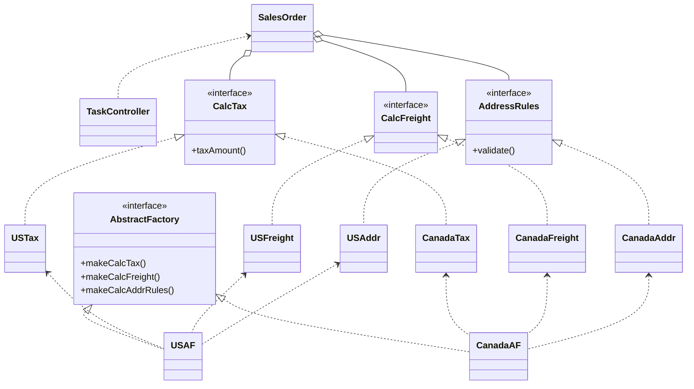

# 分析マトリクス

## メモ
- 現実世界は行儀よく整理されているわけではない
    - うまく整理しても例外がある
- パターンを用いて流動的要素を効率よく処理できるようになるか？
- 問題領域内の流動的要素を明確にした後、その分析から設計中に使用すべきパターンを洗い出すアプローチを紹介する
    1. 特定のシナリオにおいて最も重要となる機能を洗い出して、それを分析マトリクスに取り込む。この際、機能の見出しとして該当機能が表現している概念を付加する
    1. 他のシナリオについても同様にし、必要に応じて分析マトリクスを拡張する。各シナリオはそれぞれ独立して扱う
    1. 新たな概念を用いて分析マトリクスを拡張する
    1. 規則を洗い出すには行を使用する
    1. 特定の状況を洗い出すには列を使用する
    1. この分析によってデザインパターンを洗い出す
    1. 高次の設計を行う

### 例
- 国際Eコマース
- まずは顧客がアメリカにいる場合とカナダにいる場合を考える
- ↓分析マトリクス↓

|    | アメリカ国内からの注文   | カナダ国内からの注文 | 
| ---- | ---- | ---- |
| 送料の計算 | UPSの価格表を使用する | FedExの価格表を使用する |
| 住所の確認 | アメリカの郵便規則を使用する | カナダの郵便規則を使用する |
| 税金の計算 | 州税と地方税を使用する | GSTとPSTを使用する |
| 通貨| 米ドル | カナダドル |

- 分析マトリクスにパターンを入れたもの

|    | アメリカ国内からの注文   | カナダ国内からの注文 |  |
| ---- | ---- | ---- | ---- |
| 送料の計算 | UPSの価格表を使用する | FedExの価格表を使用する | この行は「送料計算」規則をカプセル化したStrategyパターンとして実装できる |
| 住所の確認 | アメリカの郵便規則を使用する | カナダの郵便規則を使用する | この行は「住所確認」規則をカプセル化したStrategyパターンとして実装できる
| 税金の計算 | 州税と地方税を使用する | GSTとPSTを使用する | この行は「税金の計算」規則をカプセル化したStrategyパターンとして実装できる |
| 通貨| 米ドル | カナダドル | 内部に保持したCurrencyとAmountから自動的に通貨換算を行う、Moneyオブジェクトを使用することができる
|| この列のオブジェクトはAbstract Factoryを使用することで体系化することができる | この列のオブジェクトはAbstract Factoryを使用することで体系化することができる

![](https://mermaid.ink/img/eyJjb2RlIjoiY2xhc3NEaWFncmFtXG5cbiAgICBTYWxlc09yZGVyIDwuLiBUYXNrQ29udHJvbGxlclxuICAgIEFic3RyYWN0RmFjdG9yeSA8fC4uIFVTQUZcbiAgICBBYnN0cmFjdEZhY3RvcnkgPHwuLiBDYW5hZGFBRlxuXG4gICAgVVNUYXggPC4uIFVTQUZcbiAgICBVU0ZyZWlnaHQgPC4uIFVTQUZcbiAgICBVU0FkZHIgPC4uIFVTQUZcblxuICAgIENhbmFkYVRheCA8Li4gQ2FuYWRhQUZcbiAgICBDYW5hZGFGcmVpZ2h0IDwuLiBDYW5hZGFBRlxuICAgIENhbmFkYUFkZHIgPC4uIENhbmFkYUFGXG5cbiAgICBTYWxlc09yZGVyIG8tLSBDYWxjVGF4XG4gICAgU2FsZXNPcmRlciBvLS0gQ2FsY0ZyZWlnaHRcbiAgICBTYWxlc09yZGVyIG8tLSBBZGRyZXNzUnVsZXNcblxuICAgIENhbGNUYXggPHwuLiBVU1RheFxuICAgIENhbGNUYXggPHwuLiBDYW5hZGFUYXhcblxuICAgIENhbGNGcmVpZ2h0IDx8Li4gVVNGcmVpZ2h0XG4gICAgQ2FsY0ZyZWlnaHQgPHwuLiBDYW5hZGFGcmVpZ2h0XG5cbiAgICBBZGRyZXNzUnVsZXMgPHwuLiBVU0FkZHJcbiAgICBBZGRyZXNzUnVsZXMgPHwuLiBDYW5hZGFBZGRyXG5cbiAgICBjbGFzcyBUYXNrQ29udHJvbGxlclxuICAgIGNsYXNzIFNhbGVzT3JkZXJcbiAgICBjbGFzcyBBYnN0cmFjdEZhY3Rvcnkge1xuICAgICAgICA8PGludGVyZmFjZT4-XG4gICAgICAgICttYWtlQ2FsY1RheCgpXG4gICAgICAgICttYWtlQ2FsY0ZyZWlnaHQoKVxuICAgICAgICArbWFrZUNhbGNBZGRyUnVsZXMoKVxuICAgIH1cblxuICAgIGNsYXNzIFVTQUZcbiAgICBjbGFzcyBDYW5hZGFBRlxuICAgIFxuICAgIGNsYXNzIENhbGNUYXgge1xuICAgICAgICA8PGludGVyZmFjZT4-XG4gICAgICAgICt0YXhBbW91bnQoKVxuICAgIH1cblxuICAgIGNsYXNzIFVTVGF4XG4gICAgY2xhc3MgQ2FuYWRhVGF4XG5cbiAgICBjbGFzcyBDYWxjRnJlaWdodCB7XG4gICAgICAgIDw8aW50ZXJmYWNlPj5cbiAgICB9XG5cbiAgICBjbGFzcyBVU0ZyZWlnaHRcbiAgICBjbGFzcyBDYW5hZGFGcmVpZ2h0XG5cbiAgICBjbGFzcyBBZGRyZXNzUnVsZXMge1xuICAgICAgICA8PGludGVyZmFjZT4-XG4gICAgICAgICt2YWxpZGF0ZSgpXG4gICAgfVxuXG4gICAgY2xhc3MgVVNBZGRyXG4gICAgY2xhc3MgQ2FuYWRhQWRkciIsIm1lcm1haWQiOnsidGhlbWUiOiJmb3Jlc3QifSwidXBkYXRlRWRpdG9yIjpmYWxzZX0)

### 練習問題
- 分析マトリクスにおいて、左端の列は何を表しているか
    - 概念
- 分析マトリクスにおいて、行は何を表しているか
    - 概念の規則
- 分析マトリクスにおいて、列は何を表しているか
    - 特定に状況
