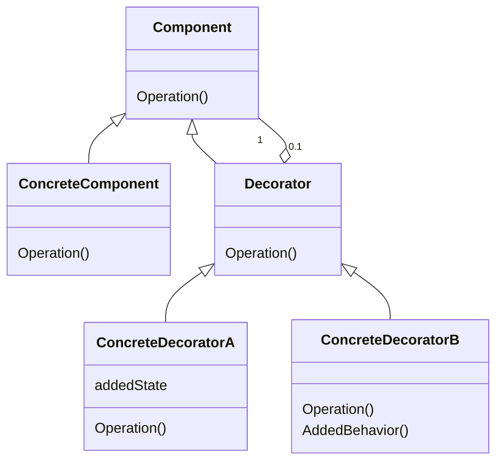
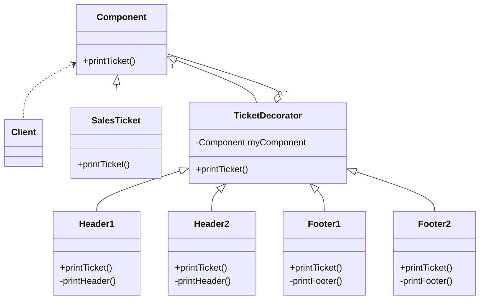

# Decoratorパターン

## Decoratorパターンとは
- オブジェクトに対して新たな責務を動的に付加する。Decoratorによって、サブクラス化による機能拡張よりも柔軟に代替案を実現できる

|    |    |
| ---- | ---- |
| 目的 | オブジェクトに対して新たな責務を動的に付加する |
| 問題| 手元にあるオブジェクトには基本的な機能が用意されているものの、そのオブジェクトの基本機能を実行する前や後に、何らかの追加機能を付加したい場合に使用できる。Javaの基本APIでは、I/O関連でDecoratorパターンが頻繁に使用されている |
| 解決策 | サブクラスを作成せずとも、オブジェクトに機能を追加することができる |
| 構成要素と協調要素 | ConcreteComponentはDecoratorによって機能の付加が行われるクラスである。ConcreteComponentからクラスを派生させることによって、核となる機能が提供される場合もしばしばある。この場合、ConcreteComponentは、その名前とは裏腹に抽象クラスとなる。Componentはこういったクラス全てのインターフェースを定義する
| 因果関係 | 付加する機能は、個々のオブジェクト内に実装される。これにより、ConcreteComponentが持つ機能の前後に動的に機能を付加できるという利点が生み出される。なおDecoratorパターンによって、核となる前後に追加機能が付加できるようになるが、連鎖の実体は常にConcreteComponentで終わることになるという点には注意 |
| 実装 | 核となる機能を表したクラスとそのクラスに付加する追加機能の双方を表す抽象クラスを作成する。Decoratorの実装では、正しい順序で呼び出しが行われるよう、後続の機能を呼び出す前か後に追加機能を呼び出す | 

### 例
- Eコマースの注文に対して伝票をプリントするケースを考える
    - 伝票のヘッダー、フッターをいろいろ付加する

![](https://mermaid.ink/img/eyJjb2RlIjoiY2xhc3NEaWFncmFtXG5cbiAgQ29tcG9uZW50IDwuLiBDbGllbnRcbiAgQ29tcG9uZW50IDx8LS0gU2FsZXNUaWNrZXRcbiAgQ29tcG9uZW50IDx8LS0gVGlja2V0RGVjb3JhdG9yXG4gIFRpY2tldERlY29yYXRvciBcIjAuLjFcIiBvLS0gXCIxXCIgQ29tcG9uZW50XG5cbiAgVGlja2V0RGVjb3JhdG9yIDx8LS0gSGVhZGVyMVxuICBUaWNrZXREZWNvcmF0b3IgPHwtLSBIZWFkZXIyXG4gIFRpY2tldERlY29yYXRvciA8fC0tIEZvb3RlcjFcbiAgVGlja2V0RGVjb3JhdG9yIDx8LS0gRm9vdGVyMlxuXG4gIGNsYXNzIENsaWVudFxuICBjbGFzcyBDb21wb25lbnQge1xuICAgICtwcmludFRpY2tldCgpXG4gIH1cbiAgY2xhc3MgU2FsZXNUaWNrZXQge1xuICAgICtwcmludFRpY2tldCgpXG4gIH1cbiAgY2xhc3MgVGlja2V0RGVjb3JhdG9yIHtcbiAgICAtQ29tcG9uZW50IG15Q29tcG9uZW50XG4gICAgK3ByaW50VGlja2V0KClcbiAgfVxuXG4gIGNsYXNzIEhlYWRlcjEge1xuICAgICtwcmludFRpY2tldCgpXG4gICAgLXByaW50SGVhZGVyKClcbiAgfVxuICBcbiAgY2xhc3MgSGVhZGVyMiB7XG4gICAgK3ByaW50VGlja2V0KClcbiAgICAtcHJpbnRIZWFkZXIoKVxuICB9XG5cbiAgY2xhc3MgRm9vdGVyMSB7XG4gICAgK3ByaW50VGlja2V0KClcbiAgICAtcHJpbnRGb290ZXIoKVxuICB9XG5cbiAgY2xhc3MgRm9vdGVyMiB7XG4gICAgK3ByaW50VGlja2V0KClcbiAgICAtcHJpbnRGb290ZXIoKVxuICB9IiwibWVybWFpZCI6eyJ0aGVtZSI6ImZvcmVzdCJ9LCJ1cGRhdGVFZGl0b3IiOmZhbHNlfQ)

- ソースコードはDecorator.scalaに書きました

## メモ
- Decoratorパターンは以下の状況を解決する 
  - 複数の追加機能が存在している
  - 追加機能群が規則にしたがっているか分からない
  - クライアントに余計なことを考えさせずに追加機能を特定の順序で付加する必要がある
  - どの追加機能を使用しているのかアプリケーション側に意識させたくない