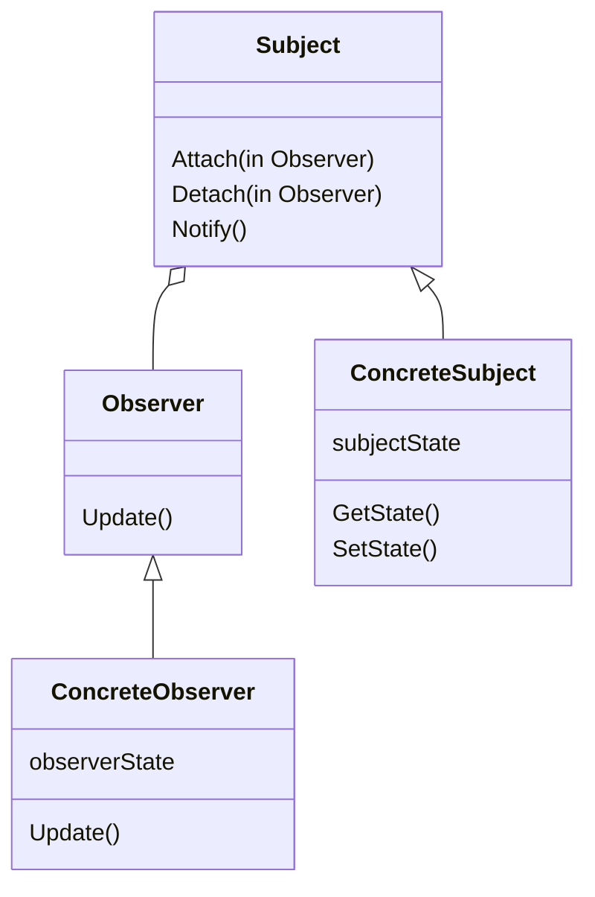
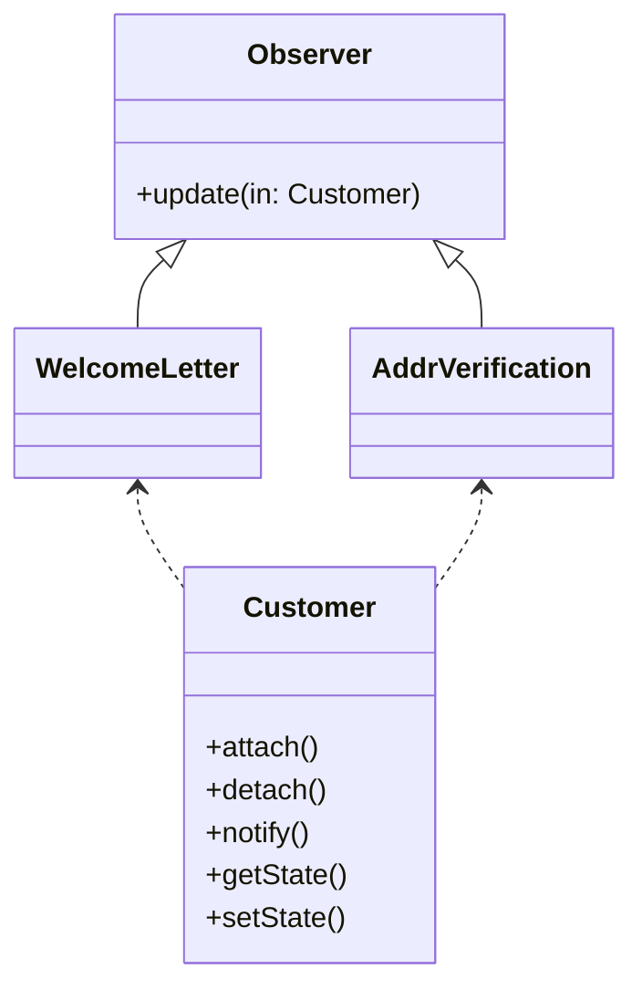

# Observerパターン

## Observerパターンとは

|    |    |
| ---- | ---- |
| 目的 | オブジェクト間に1対多の依存関係を定義し、あるオブジェクトの状態が変化した際、それに依存するすベてのオブジェクトに対して自動的に通知、更新が行われるようにする |
| 問題| 変化する一連のオブジェクトに対して、あるイベントが発生したことを通知する必要がある
| 解決策 | オブザーバは観察対象がイベントの監視を一括して行えるよう、その監視義務を委譲する
| 構成要素と協調要素 | オブザーバは自らを観察対象に登録するため、観察対象はオブザーバの存在を知っている。特定のイベントが発生した際、観察対象は全てのオブザーバに対して通知を行う必要がある。オブザーバの責務は観察対象に対する自らの登録と、通知の際における観察対象からの情報取得である
| 因果関係 | オブザーバがイベントの一部にしか興味を持っていない場合でも、観察対象はオブザーバに対して通知を行う可能性がある。観察対象がオブザーバに通知したあと、観察対象の持つ何らかの追加情報が必要になった場合、別途やりとりが発生することもある
| 実装 | イベント発生時の通知先イベント(Observer)を用意し、イベントの発生を監視している、あるいはイベント自体を発生させるオブジェクト(Subject)に自らを登録させる。イベント発生時、SubjectはObserverにイベントの発生を通知する。オブザーバとなる全てのオブジェクトにObserverインターフェースを実装するため、Adapterパターンが使用されることもある

### 例
#### 国際eコマースで考える
- 新規登録時に以下のことを行う
    - 新規顧客宛に挨拶メールを送る
    - 顧客の住所を郵便局からのデータを用いて確認する

