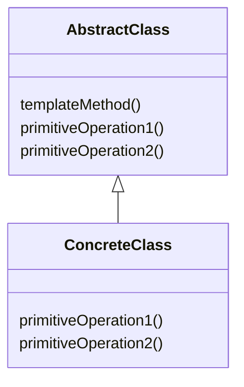

# Template Methodパターン

## Template Methodパターンとは

|    |    |
| ---- | ---- |
| 目的 | ある操作におけるアルゴリズムの骨格を定義し、いくつかの処理の定義についてはサブクラスに任せる。そして、アルゴリズムの構造を変更することなく、その中に含まれる処理の再定義を行う |
| 問題| 一定レベルで整合性のある手続きや一連の手順が存在するものの、個々の処理が詳細レベルで異なった実装になる可能性がある |
| 解決策 | 整合性のある基本手続きを維持した状態で、変化する処理部分を定義できるようになる |
| 構成要素と協調要素 | Template Methodは基本的な手順を保持した抽象クラス(AbstractClass)とその派生クラス(ConcreteClass)から成り立っている。この抽象クラスから派生した各具象クラスはテンプレートから呼び出される新規メソッドを実装する
| 因果関係 | テンプレートによって、コードを再利用する際のプラットフォームが提供される。また抽象メソッドを宣言しておくことで必要となる処理の実装を強制することも可能となる。テンプレートは各ConcreteClassがオーバーライドした処理をまとめ上げ、これらの流動的要素が常にまとめられた形で実行されるようにする |
| 実装 | 抽象クラスを作成し、手順を実装し、抽象メソッドを宣言する。これらの抽象メソッドは手順中の各処理を実行するようサブクラスにて実装する必要がある。各処理が独立して変化する場合、Strategyパターンを適用することが可能である。 | 

![](https://mermaid.ink/img/eyJjb2RlIjoiY2xhc3NEaWFncmFtXG4gIEFic3RyYWN0Q2xhc3MgPHwtLSBDb25jcmV0ZUNsYXNzXG5cbiAgY2xhc3MgQWJzdHJhY3RDbGFzcyB7XG4gICAgdGVtcGxhdGVNZXRob2QoKVxuICAgIHByaW1pdGl2ZU9wZXJhdGlvbjEoKVxuICAgIHByaW1pdGl2ZU9wZXJhdGlvbjIoKVxuICB9XG5cbiAgY2xhc3MgQ29uY3JldGVDbGFzcyB7XG4gICAgcHJpbWl0aXZlT3BlcmF0aW9uMSgpXG4gICAgcHJpbWl0aXZlT3BlcmF0aW9uMigpXG4gIH0iLCJtZXJtYWlkIjp7InRoZW1lIjoiZm9yZXN0IiwidGhlbWVWYXJpYWJsZXMiOnsiYmFja2dyb3VuZCI6IndoaXRlIiwicHJpbWFyeUNvbG9yIjoiI2NkZTQ5OCIsInNlY29uZGFyeUNvbG9yIjoiI2NkZmZiMiIsIm1haW5Ca2ciOiIjY2RlNDk4Iiwic2Vjb25kQmtnIjoiI2NkZmZiMiIsImxpbmVDb2xvciI6IiMwMDAwMDAiLCJib3JkZXIxIjoiIzEzNTQwYyIsImJvcmRlcjIiOiIjNmVhYTQ5IiwiYXJyb3doZWFkQ29sb3IiOiJncmVlbiIsImZvbnRGYW1pbHkiOiJcInRyZWJ1Y2hldCBtc1wiLCB2ZXJkYW5hLCBhcmlhbCIsImZvbnRTaXplIjoiMTZweCIsInRlcnRpYXJ5Q29sb3IiOiJoc2woNzguMTU3ODk0NzM2OCwgNTguNDYxNTM4NDYxNSUsIDg0LjUwOTgwMzkyMTYlKSIsInByaW1hcnlCb3JkZXJDb2xvciI6ImhzbCg3OC4xNTc4OTQ3MzY4LCAxOC40NjE1Mzg0NjE1JSwgNjQuNTA5ODAzOTIxNiUpIiwic2Vjb25kYXJ5Qm9yZGVyQ29sb3IiOiJoc2woOTguOTYxMDM4OTYxLCA2MCUsIDc0LjkwMTk2MDc4NDMlKSIsInRlcnRpYXJ5Qm9yZGVyQ29sb3IiOiJoc2woNzguMTU3ODk0NzM2OCwgMTguNDYxNTM4NDYxNSUsIDc0LjUwOTgwMzkyMTYlKSIsInByaW1hcnlUZXh0Q29sb3IiOiIjMzIxYjY3Iiwic2Vjb25kYXJ5VGV4dENvbG9yIjoiIzMyMDA0ZCIsInRlcnRpYXJ5VGV4dENvbG9yIjoiIzMyMWI2NyIsInRleHRDb2xvciI6IiMwMDAwMDAiLCJub2RlQmtnIjoiI2NkZTQ5OCIsIm5vZGVCb3JkZXIiOiIjMTM1NDBjIiwiY2x1c3RlckJrZyI6IiNjZGZmYjIiLCJjbHVzdGVyQm9yZGVyIjoiIzZlYWE0OSIsImRlZmF1bHRMaW5rQ29sb3IiOiIjMDAwMDAwIiwidGl0bGVDb2xvciI6IiMzMzMiLCJlZGdlTGFiZWxCYWNrZ3JvdW5kIjoiI2U4ZThlOCIsImFjdG9yQm9yZGVyIjoiaHNsKDc4LjE1Nzg5NDczNjgsIDU4LjQ2MTUzODQ2MTUlLCA1NC41MDk4MDM5MjE2JSkiLCJhY3RvckJrZyI6IiNjZGU0OTgiLCJhY3RvclRleHRDb2xvciI6ImJsYWNrIiwiYWN0b3JMaW5lQ29sb3IiOiJncmV5Iiwic2lnbmFsQ29sb3IiOiIjMzMzIiwic2lnbmFsVGV4dENvbG9yIjoiIzMzMyIsImxhYmVsQm94QmtnQ29sb3IiOiIjY2RlNDk4IiwibGFiZWxCb3hCb3JkZXJDb2xvciI6IiMzMjY5MzIiLCJsYWJlbFRleHRDb2xvciI6ImJsYWNrIiwibG9vcFRleHRDb2xvciI6ImJsYWNrIiwibm90ZUJvcmRlckNvbG9yIjoiIzZlYWE0OSIsIm5vdGVCa2dDb2xvciI6IiNmZmY1YWQiLCJub3RlVGV4dENvbG9yIjoiYmxhY2siLCJhY3RpdmF0aW9uQm9yZGVyQ29sb3IiOiIjNjY2IiwiYWN0aXZhdGlvbkJrZ0NvbG9yIjoiI2Y0ZjRmNCIsInNlcXVlbmNlTnVtYmVyQ29sb3IiOiJ3aGl0ZSIsInNlY3Rpb25Ca2dDb2xvciI6IiM2ZWFhNDkiLCJhbHRTZWN0aW9uQmtnQ29sb3IiOiJ3aGl0ZSIsInNlY3Rpb25Ca2dDb2xvcjIiOiIjNmVhYTQ5IiwidGFza0JvcmRlckNvbG9yIjoiIzEzNTQwYyIsInRhc2tCa2dDb2xvciI6IiM0ODdlM2EiLCJ0YXNrVGV4dExpZ2h0Q29sb3IiOiJ3aGl0ZSIsInRhc2tUZXh0Q29sb3IiOiJ3aGl0ZSIsInRhc2tUZXh0RGFya0NvbG9yIjoiYmxhY2siLCJ0YXNrVGV4dE91dHNpZGVDb2xvciI6ImJsYWNrIiwidGFza1RleHRDbGlja2FibGVDb2xvciI6IiMwMDMxNjMiLCJhY3RpdmVUYXNrQm9yZGVyQ29sb3IiOiIjMTM1NDBjIiwiYWN0aXZlVGFza0JrZ0NvbG9yIjoiI2NkZTQ5OCIsImdyaWRDb2xvciI6ImxpZ2h0Z3JleSIsImRvbmVUYXNrQmtnQ29sb3IiOiJsaWdodGdyZXkiLCJkb25lVGFza0JvcmRlckNvbG9yIjoiZ3JleSIsImNyaXRCb3JkZXJDb2xvciI6IiNmZjg4ODgiLCJjcml0QmtnQ29sb3IiOiJyZWQiLCJ0b2RheUxpbmVDb2xvciI6InJlZCIsImxhYmVsQ29sb3IiOiJibGFjayIsImVycm9yQmtnQ29sb3IiOiIjNTUyMjIyIiwiZXJyb3JUZXh0Q29sb3IiOiIjNTUyMjIyIiwiY2xhc3NUZXh0IjoiIzMyMWI2NyIsImZpbGxUeXBlMCI6IiNjZGU0OTgiLCJmaWxsVHlwZTEiOiIjY2RmZmIyIiwiZmlsbFR5cGUyIjoiaHNsKDE0Mi4xNTc4OTQ3MzY4LCA1OC40NjE1Mzg0NjE1JSwgNzQuNTA5ODAzOTIxNiUpIiwiZmlsbFR5cGUzIjoiaHNsKDE2Mi45NjEwMzg5NjEsIDEwMCUsIDg0LjkwMTk2MDc4NDMlKSIsImZpbGxUeXBlNCI6ImhzbCgxNC4xNTc4OTQ3MzY4LCA1OC40NjE1Mzg0NjE1JSwgNzQuNTA5ODAzOTIxNiUpIiwiZmlsbFR5cGU1IjoiaHNsKDM0Ljk2MTAzODk2MSwgMTAwJSwgODQuOTAxOTYwNzg0MyUpIiwiZmlsbFR5cGU2IjoiaHNsKDIwNi4xNTc4OTQ3MzY4LCA1OC40NjE1Mzg0NjE1JSwgNzQuNTA5ODAzOTIxNiUpIiwiZmlsbFR5cGU3IjoiaHNsKDIyNi45NjEwMzg5NjEsIDEwMCUsIDg0LjkwMTk2MDc4NDMlKSJ9fX0)