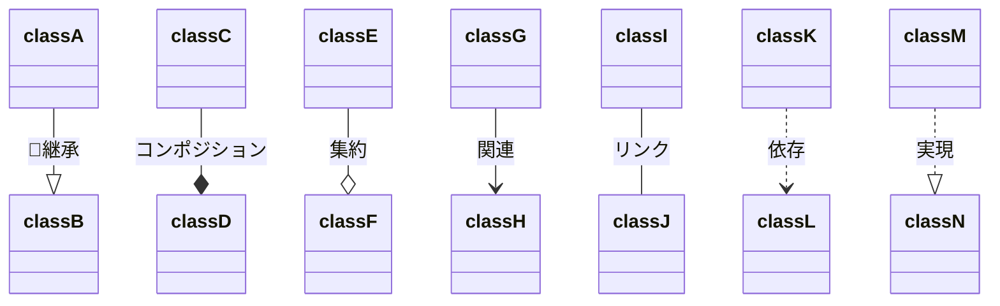
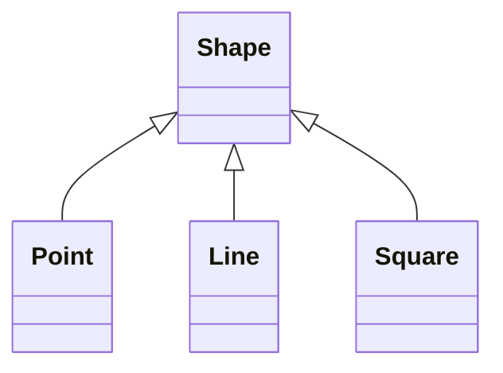
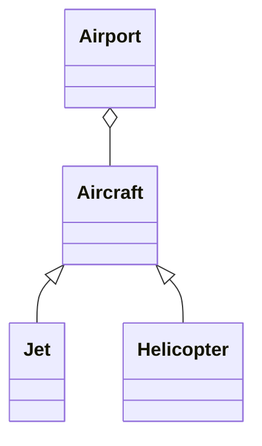
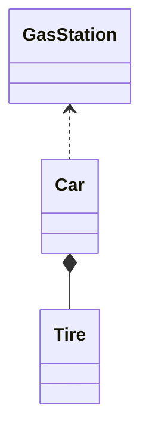
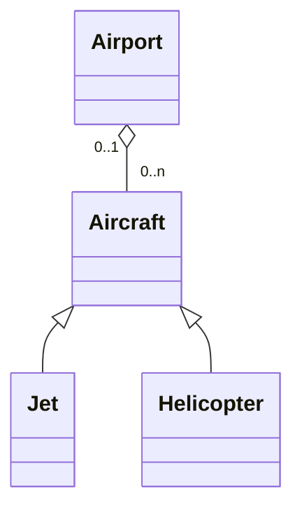
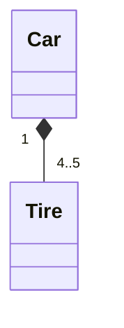

# UML 統一モデリング言語

## メモ
- UMLはプログラムのモデルを表現するために使用される視覚言語
- プログラムのモデルとはソースコードのオブジェクト間の関係を意味している
- UMLはコミュニケーションのために使われる

## クラス図
- UMLの基本となる図
- クラス間の関係を表現する

```mermaid
classDiagram
    class Square
    Square : +display()
    Square : #calc()
    Square : -length: Double
```
- `+`記号はメソッドがpublicであることを示している
    - `display()`メソッドは`Square`クラス以外からも呼ぶことができる
- `-`記号はデータメンバがprivateであることを示している
- `#`記号はメソッドがprotectedであることを示している
---


|  &nbsp;&nbsp;用語&nbsp;&nbsp;    |  解説  |
| ---- | ---- |
|  継承(Inheritance)  | 属性/操作/関連を引き継ぐ。矢印の先端が継承元となる。汎化(generalization)と呼んだりもする  |
| コンポジション(Composition)  | 関連の一種で、より強い集約を表す。全体が削除された時点で、部分も共に削除されると考えられる。あるオブジェクトはそれを保持するオブジェクトの一部となっている | 
| 集約(Aggregation) | 関連の一種で、「全体－部分」関係を表す。あるオブジェクトはそれを保持しているオブジェクトにおける何らかのコレクションになっている |
| 関連(Association)| クラス間に、参照や実体を保持するなどの関係があることを表す。線の両端には矢印をつけることができ、矢印がある場合は、その方向にのみ関連があることを示す。これを誘導可能性(navigability)と言い、矢印の無い関連は、誘導可能性が未知であるか、双方向であることを意味する。 |
| リンク(Link) | 関連における矢印のないもの。誘導可能性が未知か双方向であることを示す | 
| 依存(Dependency)| 相手の変更によって影響を受ける関係。引数などで一時的に使用するクラスやイベント通知などを表現するときに使用する |
| 実現(Realization)| 操作のインターフェースを引き継ぐ。Javaのinterfaceに相当する。矢印の先端が実現元  | 

----
- あるクラスが他のクラスの一種である(`is-a関係`)の例

----
- あるクラスが他のクラスを保持している(`has-a関係`)の例

----
- あるクラスが他のクラスを使用している(`use-a関係`)の例

---
- あるクラスが他のクラスを保持する場合、カーディナリティという、クラス間の個数を定義する
    - 下記の例だとAircraftがある場合、0もしくは1つのAirportに保持されているということを示している
    - Airportがある場合、0 ~ nのAircraftを保持できる



## mermaidの動かし方
- [mermaid](https://mermaid-js.github.io/mermaid/#/classDiagram)
- [VSCode Extension](https://marketplace.visualstudio.com/items?itemName=bierner.markdown-mermaid)

## 参考
- http://objectclub.jp/technicaldoc/uml/umlintro2#class