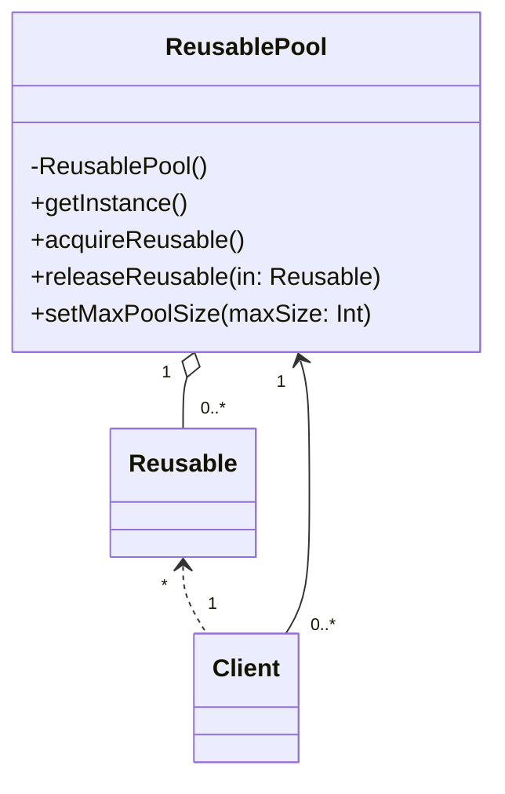

# Object Poolパターン

## Object Poolパターンとは

|    |    |
| ---- | ---- |
| 目的 | オブジェクトの生成が高価なものであるか、生成可能なオブジェクト総数が制限されている際に、オブジェクトの再利用を管理する |
| 問題|  特定の規則に従ったオブジェクトの生成および/あるいは管理が必要となる。こういった規則は通常の場合、オブジェクトの生成方法、生成オブジェクト数、そのオブジェクトを用いた作業が終了した際における該当オブジェクトの再利用方法に関連するものとなる |
| 解決策 | ClientはReusableオブジェクトが必要となった時に、Reusable-PoolのacquireReusableメソッドを呼び出す。プールが空の場合、acquireReusableメソッドは可能であればReusableオブジェクトを生成する。可能でない場合、Reusableオブジェクトがプールに返されるまで待ち続ける。 |
| 構成要素と協調要素| ReusablePoolはClientによって使用されるReusableオブジェクトの利用可能性を管理する。Clientはその後、一定時間に渡ってReusableオブジェクトのインスタンスを使用する。ReusablePoolには全てのReusableオブジェクトが保持されているため、統一した方法で管理することができる | 
| 因果関係 | 長期にわたって整合性を要求されるオブジェクトが必要となる場合や、要求における流動的要素の占める割合が大きくパフォーマンスの問題が懸念される場合に有効となる。ObjectPoolパターンではこういった問題に取り組むために、生成されるオブジェクトの総数を制限する。インスタンスの生成を管理するためのロジックを管理されるインスタンスのクラスから切り出すことによって、より凝集度の高い設計にすることができる | 
| 実装 | 生成するオブジェクトの総数やプールのサイズに制約がある場合、プールの実装には簡単な配列を使用する。制約がない場合、ベクタオブジェクトを使用する。オブジェクトプールの管理に責任を持つオブジェクトのみがこういったオブジェクトを生成できるようになっていなければならない。ReusablePoolはSingletonパターンによって実装される。また、Reusableオブジェクトの方に解放メソッドを追加し、自らプールに戻るような方法も考えられる。 |

![](https://mermaid.ink/img/eyJjb2RlIjoiY2xhc3NEaWFncmFtXG4gIFJldXNhYmxlIFwiKlwiIDwuLiBcIjFcIiBDbGllbnRcbiAgUmV1c2FibGVQb29sIFwiMVwiIDwtLSBcIjAuLipcIiBDbGllbnRcbiAgUmV1c2FibGVQb29sIFwiMVwiIG8tLSBcIjAuLipcIiBSZXVzYWJsZVxuXG4gIGNsYXNzIENsaWVudFxuICBjbGFzcyBSZXVzYWJsZVxuICBjbGFzcyBSZXVzYWJsZVBvb2wge1xuICAgIC1SZXVzYWJsZVBvb2woKVxuICAgICtnZXRJbnN0YW5jZSgpXG4gICAgK2FjcXVpcmVSZXVzYWJsZSgpXG4gICAgK3JlbGVhc2VSZXVzYWJsZShpbjogUmV1c2FibGUpXG4gICAgK3NldE1heFBvb2xTaXplKG1heFNpemU6IEludClcbiAgfSIsIm1lcm1haWQiOnsidGhlbWUiOiJmb3Jlc3QiLCJ0aGVtZVZhcmlhYmxlcyI6eyJiYWNrZ3JvdW5kIjoid2hpdGUiLCJwcmltYXJ5Q29sb3IiOiIjY2RlNDk4Iiwic2Vjb25kYXJ5Q29sb3IiOiIjY2RmZmIyIiwibWFpbkJrZyI6IiNjZGU0OTgiLCJzZWNvbmRCa2ciOiIjY2RmZmIyIiwibGluZUNvbG9yIjoiIzAwMDAwMCIsImJvcmRlcjEiOiIjMTM1NDBjIiwiYm9yZGVyMiI6IiM2ZWFhNDkiLCJhcnJvd2hlYWRDb2xvciI6ImdyZWVuIiwiZm9udEZhbWlseSI6IlwidHJlYnVjaGV0IG1zXCIsIHZlcmRhbmEsIGFyaWFsIiwiZm9udFNpemUiOiIxNnB4IiwidGVydGlhcnlDb2xvciI6ImhzbCg3OC4xNTc4OTQ3MzY4LCA1OC40NjE1Mzg0NjE1JSwgODQuNTA5ODAzOTIxNiUpIiwicHJpbWFyeUJvcmRlckNvbG9yIjoiaHNsKDc4LjE1Nzg5NDczNjgsIDE4LjQ2MTUzODQ2MTUlLCA2NC41MDk4MDM5MjE2JSkiLCJzZWNvbmRhcnlCb3JkZXJDb2xvciI6ImhzbCg5OC45NjEwMzg5NjEsIDYwJSwgNzQuOTAxOTYwNzg0MyUpIiwidGVydGlhcnlCb3JkZXJDb2xvciI6ImhzbCg3OC4xNTc4OTQ3MzY4LCAxOC40NjE1Mzg0NjE1JSwgNzQuNTA5ODAzOTIxNiUpIiwicHJpbWFyeVRleHRDb2xvciI6IiMzMjFiNjciLCJzZWNvbmRhcnlUZXh0Q29sb3IiOiIjMzIwMDRkIiwidGVydGlhcnlUZXh0Q29sb3IiOiIjMzIxYjY3IiwidGV4dENvbG9yIjoiIzAwMDAwMCIsIm5vZGVCa2ciOiIjY2RlNDk4Iiwibm9kZUJvcmRlciI6IiMxMzU0MGMiLCJjbHVzdGVyQmtnIjoiI2NkZmZiMiIsImNsdXN0ZXJCb3JkZXIiOiIjNmVhYTQ5IiwiZGVmYXVsdExpbmtDb2xvciI6IiMwMDAwMDAiLCJ0aXRsZUNvbG9yIjoiIzMzMyIsImVkZ2VMYWJlbEJhY2tncm91bmQiOiIjZThlOGU4IiwiYWN0b3JCb3JkZXIiOiJoc2woNzguMTU3ODk0NzM2OCwgNTguNDYxNTM4NDYxNSUsIDU0LjUwOTgwMzkyMTYlKSIsImFjdG9yQmtnIjoiI2NkZTQ5OCIsImFjdG9yVGV4dENvbG9yIjoiYmxhY2siLCJhY3RvckxpbmVDb2xvciI6ImdyZXkiLCJzaWduYWxDb2xvciI6IiMzMzMiLCJzaWduYWxUZXh0Q29sb3IiOiIjMzMzIiwibGFiZWxCb3hCa2dDb2xvciI6IiNjZGU0OTgiLCJsYWJlbEJveEJvcmRlckNvbG9yIjoiIzMyNjkzMiIsImxhYmVsVGV4dENvbG9yIjoiYmxhY2siLCJsb29wVGV4dENvbG9yIjoiYmxhY2siLCJub3RlQm9yZGVyQ29sb3IiOiIjNmVhYTQ5Iiwibm90ZUJrZ0NvbG9yIjoiI2ZmZjVhZCIsIm5vdGVUZXh0Q29sb3IiOiJibGFjayIsImFjdGl2YXRpb25Cb3JkZXJDb2xvciI6IiM2NjYiLCJhY3RpdmF0aW9uQmtnQ29sb3IiOiIjZjRmNGY0Iiwic2VxdWVuY2VOdW1iZXJDb2xvciI6IndoaXRlIiwic2VjdGlvbkJrZ0NvbG9yIjoiIzZlYWE0OSIsImFsdFNlY3Rpb25Ca2dDb2xvciI6IndoaXRlIiwic2VjdGlvbkJrZ0NvbG9yMiI6IiM2ZWFhNDkiLCJ0YXNrQm9yZGVyQ29sb3IiOiIjMTM1NDBjIiwidGFza0JrZ0NvbG9yIjoiIzQ4N2UzYSIsInRhc2tUZXh0TGlnaHRDb2xvciI6IndoaXRlIiwidGFza1RleHRDb2xvciI6IndoaXRlIiwidGFza1RleHREYXJrQ29sb3IiOiJibGFjayIsInRhc2tUZXh0T3V0c2lkZUNvbG9yIjoiYmxhY2siLCJ0YXNrVGV4dENsaWNrYWJsZUNvbG9yIjoiIzAwMzE2MyIsImFjdGl2ZVRhc2tCb3JkZXJDb2xvciI6IiMxMzU0MGMiLCJhY3RpdmVUYXNrQmtnQ29sb3IiOiIjY2RlNDk4IiwiZ3JpZENvbG9yIjoibGlnaHRncmV5IiwiZG9uZVRhc2tCa2dDb2xvciI6ImxpZ2h0Z3JleSIsImRvbmVUYXNrQm9yZGVyQ29sb3IiOiJncmV5IiwiY3JpdEJvcmRlckNvbG9yIjoiI2ZmODg4OCIsImNyaXRCa2dDb2xvciI6InJlZCIsInRvZGF5TGluZUNvbG9yIjoicmVkIiwibGFiZWxDb2xvciI6ImJsYWNrIiwiZXJyb3JCa2dDb2xvciI6IiM1NTIyMjIiLCJlcnJvclRleHRDb2xvciI6IiM1NTIyMjIiLCJjbGFzc1RleHQiOiIjMzIxYjY3IiwiZmlsbFR5cGUwIjoiI2NkZTQ5OCIsImZpbGxUeXBlMSI6IiNjZGZmYjIiLCJmaWxsVHlwZTIiOiJoc2woMTQyLjE1Nzg5NDczNjgsIDU4LjQ2MTUzODQ2MTUlLCA3NC41MDk4MDM5MjE2JSkiLCJmaWxsVHlwZTMiOiJoc2woMTYyLjk2MTAzODk2MSwgMTAwJSwgODQuOTAxOTYwNzg0MyUpIiwiZmlsbFR5cGU0IjoiaHNsKDE0LjE1Nzg5NDczNjgsIDU4LjQ2MTUzODQ2MTUlLCA3NC41MDk4MDM5MjE2JSkiLCJmaWxsVHlwZTUiOiJoc2woMzQuOTYxMDM4OTYxLCAxMDAlLCA4NC45MDE5NjA3ODQzJSkiLCJmaWxsVHlwZTYiOiJoc2woMjA2LjE1Nzg5NDczNjgsIDU4LjQ2MTUzODQ2MTUlLCA3NC41MDk4MDM5MjE2JSkiLCJmaWxsVHlwZTciOiJoc2woMjI2Ljk2MTAzODk2MSwgMTAwJSwgODQuOTAxOTYwNzg0MyUpIn19LCJ1cGRhdGVFZGl0b3IiOmZhbHNlfQ)

