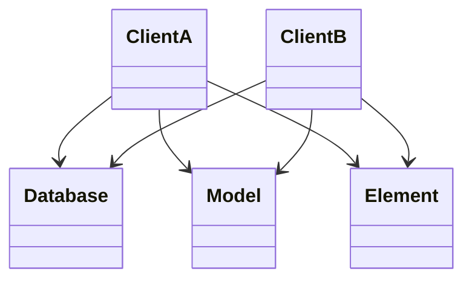
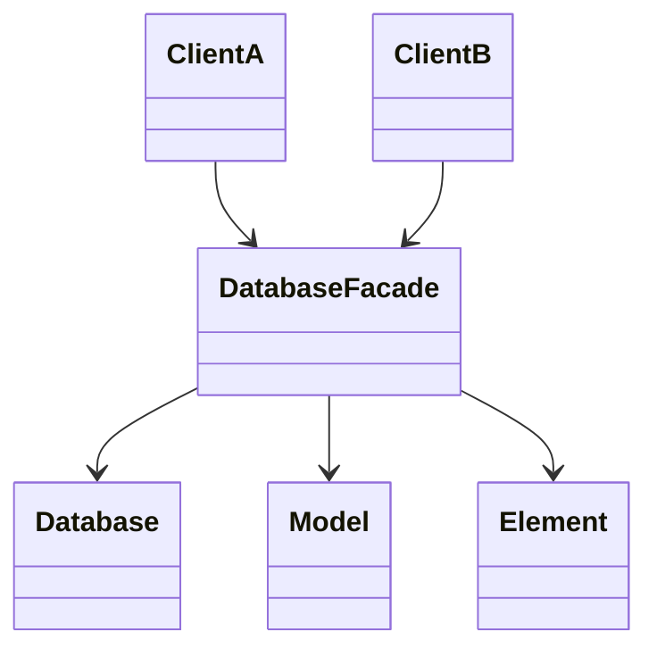

# Facadeパターン

## Facadeパターンとは
- サブシステム内に存在している複数のインターフェース群に対する、統一したインターフェースを提供する。Facadeは高レベルのインターフェースを定義することにより、サブシステムを容易に扱えるようにするものである

|    |    |
| ---- | ---- |
| 目的 | 既存システムの使用方法を簡素化したい。独自のインターフェースを定義する必要がある|
| 問題| 複雑なシステムの一部だけを使用する必要がある。あるいは、特定の方法でシステムとのやりとりが必要|
| 解決策 | Facadeによって、既存システムを使用するクライアント向けに新たなインターフェースを作成する|
|構成要素と協調要素| このパターンは、複雑なシステムの使用が容易になるよう、クライアントに対して簡潔なインターフェースを提供する |

---
- Before

- After

- その他の用途
    - システムアクセスをFacade経由にして利用状態を監視する
    - システムを交換する際に、Facadeのprivateメンバだけなら、影響を最小限に抑えられる