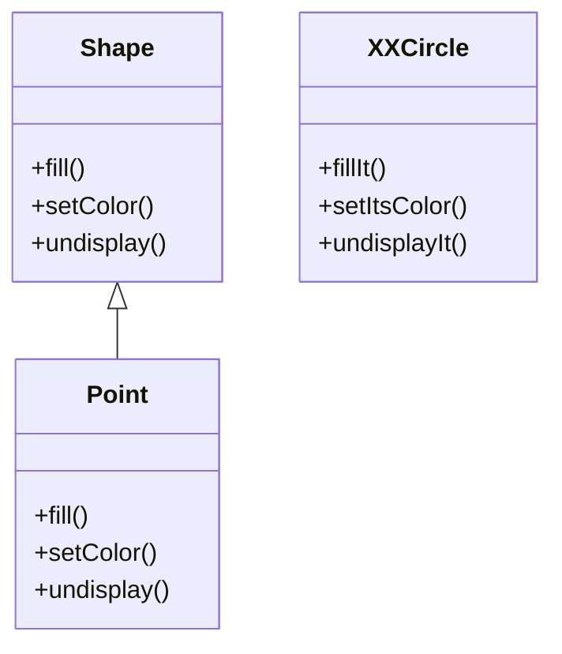
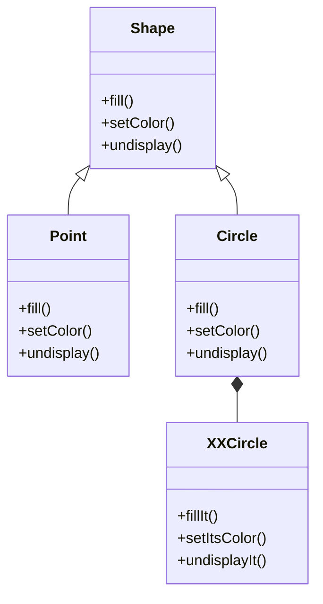

# Adapterパターン

## Adapterパターンとは
- あるクラスのインターフェースを、クライアントが望むインターフェースに変換する。Adapterによってクラス群は互換性のあるインターフェースを持つことになり、協調して動作できるようになる

|    |    |
| ---- | ---- |
| 目的 | 修正することのできない既存オブジェクトを、特定のインターフェースに適合させる |
| 問題| 使用したいデータや振る舞いが既存システム内に存在しているものの、そのインターフェースが正しくない場合。通常は、抽象クラスから何かしらの派生物を作成しなければならない場合に使用する |
| 解決策 | 必要なインターフェースを保持したラッパーをAdapterによって提供する |

---
- Before
    - ShapeからCircleを派生させたいが、既存のXXCircleは名前やパラメータリストが異なっており派生させることができない

---
- After
    - Shapeから派生したCircleクラスを作る
    - CircleにXXCircleを保持させる
    - Circleオブジェクトに対するリクエストをXXCircleオブジェクトに転送する

## FacadeとAdapterの共通点と違い
- FacadeとAdapterはいずれも既存クラスを使用する
- Facadeでは既存インターフェースを設計し直す必要がない。Adapterパターンではインターフェースを設計し直す必要がある
- Facadeではポリモーフィズムに則った振る舞いは不要であるが、Adapterではおそらく必要になる。
- Facadeの目的はインターフェースを簡素化するため。Adapterの本来の目的は既存インターフェースの再設計。
- Facadeはインターフェースの簡素化
- Adapterは既存インターフェースを他のインターフェースに変換する