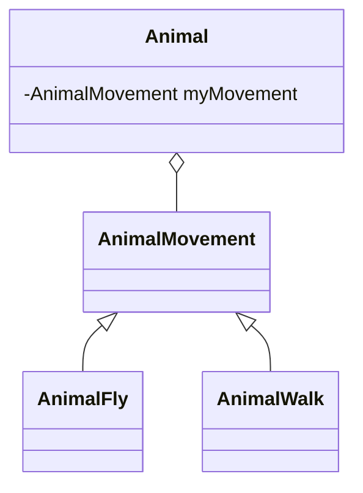

# 視野を広げる

## 従来の考え方と新たな考え方
|  従来の考え方 | 従来の考え方の問題点 | 新たな考え方 | 新たな考え方の利点
| ---- | ---- | ---- | ---- |
| オブジェクトとは操作(メソッドを)を伴ったデータである | オブジェクトを実装観点からしか見ていない | オブジェクトは責務を備えた実体である | 概念上の観点を用いることで、オブジェクトが**何を実行するか** という観点に着目しながら開発ができる。また実装の詳細について早すぎるタイミングで考える必要がなくなる(着目点を公開インターフェースに絞ることができる)
| カプセル化とはデータの隠蔽である | データ隠蔽はカプセル化の一側面でしかない  | カプセル化とはあらゆるもの(データ・メソッド・その他のオブジェクト・型...)を隠蔽すること | 様々な種類の形状をカプセル化しておくことで、それを使用するクライアントプログラムを変更することなく、新たな種類の形状を追加できる
| 特化のために継承を利用する | 凝集性が低下する可能性がある・再利用の可能性が低下する・変化に追随できない | 流動的要素を見つけ出し、それをカプセル化する |  下記のクラス図のようにAnimalクラスにAnimalMovementを保持させる(AnimalMovementは流動的要素)ことで振る舞いにおける流動的要素をオブジェクトとして取り扱う。こうすることでif,switchなどで条件分岐をすることや、継承を用いたクラス爆発を防ぐことができる

## メモ
- 実装ではなく動機に着目するというのはデザインパターンで何度も出てくるスローガン
- 共通性分析によって流動的要素をまとめることができる。こういった概念は抽象クラスによって表現できる