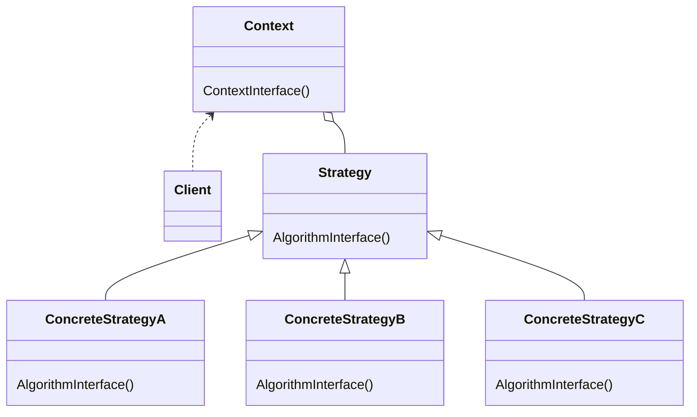

# Strategyパターン

## Strategyパターンとは
- アルゴリズムのファミリを定義し、それぞれをカプセル化し、それらを交換可能なものにすること。Strategyパターンにより、クライアントが使用するアルゴリズムを独立して変更できるようにする

|    |    |
| ---- | ---- |
| 目的 | 様々な業務上の規則(ビジネスルール)やアルゴリズムをそれが発生するコンテキストによって使い分けられるようにする |
| 問題| 要求を行うクライアントや操作対象のデータによって適用するアルゴリズムを選択する必要がある。規則が変化しないならStrategyパターンは不要 |
| 解決策 | 該当アルゴリズムの実装からアルゴリズムを個別に切り出す。これによりコンテキストによる選択が可能になる |
| 実現| アルゴリズムを使用する側のクラス(Context)に、該当アルゴリズムの呼び出し方法を抽象メソッドとして定義した抽象クラス(Strategy)を保持させる。そして、それぞれの派生クラスでアルゴリズムを実装する |

## メモ
- 変更のことを考慮した設計は変更内容を正確に予測するのではなく、どこに変更が発生するのかを予測する
- GoF本による原則
    - 実装を用いてプログラミングするのではなく、インターフェースを用いてプログラミングする
    - クラス継承よりもオブジェクトの集約を多用する
    - 設計において何を流動的要素とするべきかを考察する
        - 再設計せずに変更可能にする
        - 流動的概念のカプセル化