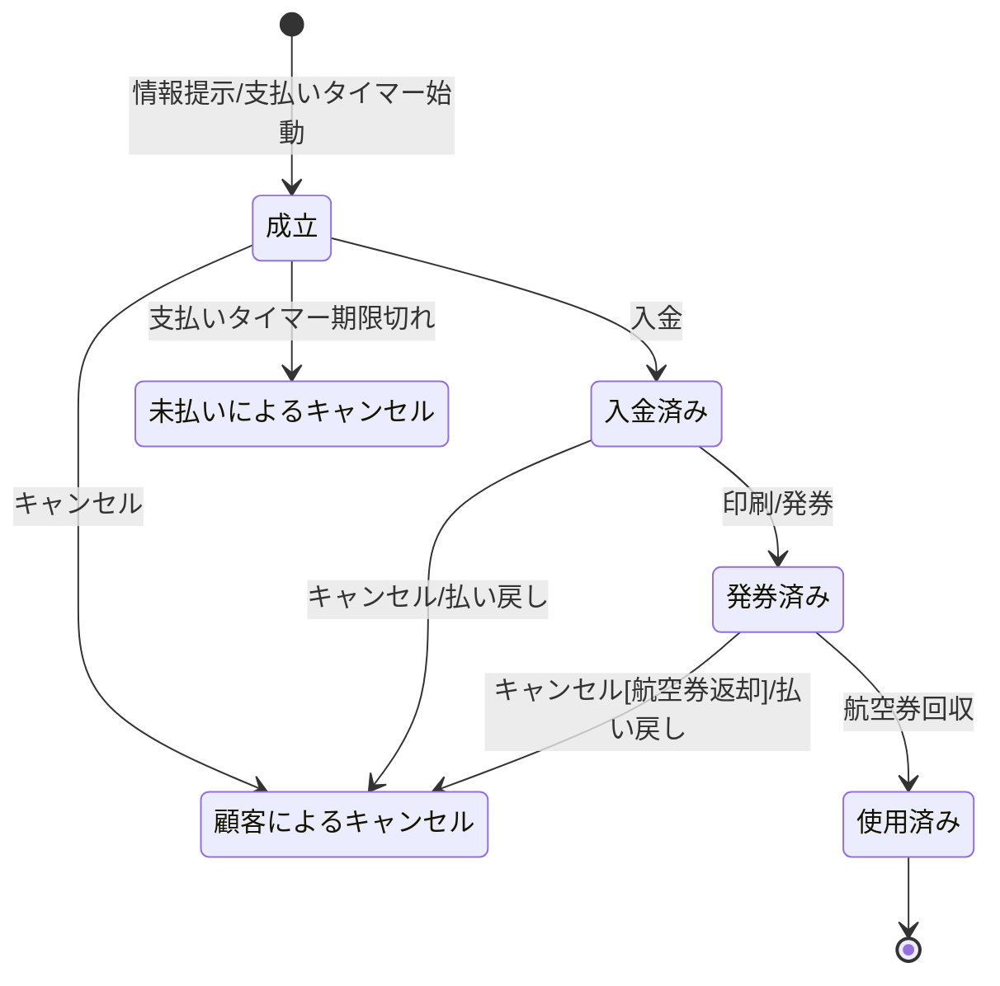

# 状態遷移テスト

## 概要
- 状態(円で表される)
    - 状態はシステムが一つまたは複数のイベントを待っている状況を意味する
- 遷移(矢印で表される)
    - 遷移はイベントによってある状態から別の状態へと変わることを意味する
- イベント(矢印の側のラベルで表される)
    - システムの状態を変更させる何か
- アクション('/'に続くコマンドで表される)
    - 状態の変更によって引き起こされる操作

<!-- ![](https://mermaid.ink/img/eyJjb2RlIjoic3RhdGVEaWFncmFtXG5cdFsqXSAtLT4g5oiQ56uLOuaDheWgseaPkOekui_mlK_miZXjgYTjgr_jgqTjg57jg7zlp4vli5VcbiAg5oiQ56uLIC0tPiDlhaXph5HmuIjjgb865YWl6YeRXG4gIOaIkOeriyAtLT4g5pyq5omV44GE44Gr44KI44KL44Kt44Oj44Oz44K744OrOuaUr-aJleOBhOOCv-OCpOODnuODvOacn-mZkOWIh-OCjFxuICDmiJDnq4sgLS0-IOmhp-WuouOBq-OCiOOCi-OCreODo-ODs-OCu-ODqzrjgq3jg6Pjg7Pjgrvjg6tcblx05YWl6YeR5riI44G_IC0tPiDnmbrliLjmuIjjgb865Y2w5Yi3L-eZuuWIuFxuICDlhaXph5HmuIjjgb8gLS0-IOmhp-WuouOBq-OCiOOCi-OCreODo-ODs-OCu-ODqzrjgq3jg6Pjg7Pjgrvjg6sv5omV44GE5oi744GXXG4gIOeZuuWIuOa4iOOBvyAtLT4g5L2_55So5riI44G_OuiIquepuuWIuOWbnuWPjlxuICDnmbrliLjmuIjjgb8gLS0-IOmhp-WuouOBq-OCiOOCi-OCreODo-ODs-OCu-ODqzrjgq3jg6Pjg7Pjgrvjg6tb6Iiq56m65Yi46L-U5Y20XS_miZXjgYTmiLvjgZdcbiAg5L2_55So5riI44G_IC0tPiBbKl0iLCJtZXJtYWlkIjp7InRoZW1lIjoiZm9yZXN0IiwidGhlbWVWYXJpYWJsZXMiOnsiYmFja2dyb3VuZCI6IndoaXRlIiwicHJpbWFyeUNvbG9yIjoiI2NkZTQ5OCIsInNlY29uZGFyeUNvbG9yIjoiI2NkZmZiMiIsIm1haW5Ca2ciOiIjY2RlNDk4Iiwic2Vjb25kQmtnIjoiI2NkZmZiMiIsImxpbmVDb2xvciI6IiMwMDAwMDAiLCJib3JkZXIxIjoiIzEzNTQwYyIsImJvcmRlcjIiOiIjNmVhYTQ5IiwiYXJyb3doZWFkQ29sb3IiOiJncmVlbiIsImZvbnRGYW1pbHkiOiJcInRyZWJ1Y2hldCBtc1wiLCB2ZXJkYW5hLCBhcmlhbCIsImZvbnRTaXplIjoiMTZweCIsInRlcnRpYXJ5Q29sb3IiOiJoc2woNzguMTU3ODk0NzM2OCwgNTguNDYxNTM4NDYxNSUsIDg0LjUwOTgwMzkyMTYlKSIsInByaW1hcnlCb3JkZXJDb2xvciI6ImhzbCg3OC4xNTc4OTQ3MzY4LCAxOC40NjE1Mzg0NjE1JSwgNjQuNTA5ODAzOTIxNiUpIiwic2Vjb25kYXJ5Qm9yZGVyQ29sb3IiOiJoc2woOTguOTYxMDM4OTYxLCA2MCUsIDc0LjkwMTk2MDc4NDMlKSIsInRlcnRpYXJ5Qm9yZGVyQ29sb3IiOiJoc2woNzguMTU3ODk0NzM2OCwgMTguNDYxNTM4NDYxNSUsIDc0LjUwOTgwMzkyMTYlKSIsInByaW1hcnlUZXh0Q29sb3IiOiIjMzIxYjY3Iiwic2Vjb25kYXJ5VGV4dENvbG9yIjoiIzMyMDA0ZCIsInRlcnRpYXJ5VGV4dENvbG9yIjoiIzMyMWI2NyIsInRleHRDb2xvciI6IiMwMDAwMDAiLCJub2RlQmtnIjoiI2NkZTQ5OCIsIm5vZGVCb3JkZXIiOiIjMTM1NDBjIiwiY2x1c3RlckJrZyI6IiNjZGZmYjIiLCJjbHVzdGVyQm9yZGVyIjoiIzZlYWE0OSIsImRlZmF1bHRMaW5rQ29sb3IiOiIjMDAwMDAwIiwidGl0bGVDb2xvciI6IiMzMzMiLCJlZGdlTGFiZWxCYWNrZ3JvdW5kIjoiI2U4ZThlOCIsImFjdG9yQm9yZGVyIjoiaHNsKDc4LjE1Nzg5NDczNjgsIDU4LjQ2MTUzODQ2MTUlLCA1NC41MDk4MDM5MjE2JSkiLCJhY3RvckJrZyI6IiNjZGU0OTgiLCJhY3RvclRleHRDb2xvciI6ImJsYWNrIiwiYWN0b3JMaW5lQ29sb3IiOiJncmV5Iiwic2lnbmFsQ29sb3IiOiIjMzMzIiwic2lnbmFsVGV4dENvbG9yIjoiIzMzMyIsImxhYmVsQm94QmtnQ29sb3IiOiIjY2RlNDk4IiwibGFiZWxCb3hCb3JkZXJDb2xvciI6IiMzMjY5MzIiLCJsYWJlbFRleHRDb2xvciI6ImJsYWNrIiwibG9vcFRleHRDb2xvciI6ImJsYWNrIiwibm90ZUJvcmRlckNvbG9yIjoiIzZlYWE0OSIsIm5vdGVCa2dDb2xvciI6IiNmZmY1YWQiLCJub3RlVGV4dENvbG9yIjoiYmxhY2siLCJhY3RpdmF0aW9uQm9yZGVyQ29sb3IiOiIjNjY2IiwiYWN0aXZhdGlvbkJrZ0NvbG9yIjoiI2Y0ZjRmNCIsInNlcXVlbmNlTnVtYmVyQ29sb3IiOiJ3aGl0ZSIsInNlY3Rpb25Ca2dDb2xvciI6IiM2ZWFhNDkiLCJhbHRTZWN0aW9uQmtnQ29sb3IiOiJ3aGl0ZSIsInNlY3Rpb25Ca2dDb2xvcjIiOiIjNmVhYTQ5IiwidGFza0JvcmRlckNvbG9yIjoiIzEzNTQwYyIsInRhc2tCa2dDb2xvciI6IiM0ODdlM2EiLCJ0YXNrVGV4dExpZ2h0Q29sb3IiOiJ3aGl0ZSIsInRhc2tUZXh0Q29sb3IiOiJ3aGl0ZSIsInRhc2tUZXh0RGFya0NvbG9yIjoiYmxhY2siLCJ0YXNrVGV4dE91dHNpZGVDb2xvciI6ImJsYWNrIiwidGFza1RleHRDbGlja2FibGVDb2xvciI6IiMwMDMxNjMiLCJhY3RpdmVUYXNrQm9yZGVyQ29sb3IiOiIjMTM1NDBjIiwiYWN0aXZlVGFza0JrZ0NvbG9yIjoiI2NkZTQ5OCIsImdyaWRDb2xvciI6ImxpZ2h0Z3JleSIsImRvbmVUYXNrQmtnQ29sb3IiOiJsaWdodGdyZXkiLCJkb25lVGFza0JvcmRlckNvbG9yIjoiZ3JleSIsImNyaXRCb3JkZXJDb2xvciI6IiNmZjg4ODgiLCJjcml0QmtnQ29sb3IiOiJyZWQiLCJ0b2RheUxpbmVDb2xvciI6InJlZCIsImxhYmVsQ29sb3IiOiJibGFjayIsImVycm9yQmtnQ29sb3IiOiIjNTUyMjIyIiwiZXJyb3JUZXh0Q29sb3IiOiIjNTUyMjIyIiwiY2xhc3NUZXh0IjoiIzMyMWI2NyIsImZpbGxUeXBlMCI6IiNjZGU0OTgiLCJmaWxsVHlwZTEiOiIjY2RmZmIyIiwiZmlsbFR5cGUyIjoiaHNsKDE0Mi4xNTc4OTQ3MzY4LCA1OC40NjE1Mzg0NjE1JSwgNzQuNTA5ODAzOTIxNiUpIiwiZmlsbFR5cGUzIjoiaHNsKDE2Mi45NjEwMzg5NjEsIDEwMCUsIDg0LjkwMTk2MDc4NDMlKSIsImZpbGxUeXBlNCI6ImhzbCgxNC4xNTc4OTQ3MzY4LCA1OC40NjE1Mzg0NjE1JSwgNzQuNTA5ODAzOTIxNiUpIiwiZmlsbFR5cGU1IjoiaHNsKDM0Ljk2MTAzODk2MSwgMTAwJSwgODQuOTAxOTYwNzg0MyUpIiwiZmlsbFR5cGU2IjoiaHNsKDIwNi4xNTc4OTQ3MzY4LCA1OC40NjE1Mzg0NjE1JSwgNzQuNTA5ODAzOTIxNiUpIiwiZmlsbFR5cGU3IjoiaHNsKDIyNi45NjEwMzg5NjEsIDEwMCUsIDg0LjkwMTk2MDc4NDMlKSJ9fSwidXBkYXRlRWRpdG9yIjpmYWxzZX0) -->

## 状態遷移表
- 下記のようなもの
- 全ての可能な状態遷移の組み合わせを列挙している

| 現在の状態 | イベント | アクション | 次の状態 |
| -- | -- | -- | -- |
| なし | 情報提示 | 支払いタイマー始動 | 成立 |
| なし | 入金 | - | なし |
| なし | 印刷 | - | なし |
| なし | 航空券回収 | - | なし |
| なし | キャンセル | - | なし |
| なし | 支払いタイマー期限切れ | - | なし |
| ... | ... | ... | ... |

## テストケース作成
- カバレッジ上4つの異なるレベルが定義できる

### 全ての状態を少なくとも1回訪れるような1組みのテストケースを作成
- テストカバレッジとしては弱い

### 全てのイベントが少なくとも1回は起動されるような1組のテストケースを作成
- カバレッジとしては弱い

### テスト対象の全てのパスが少なくとも1回は実行されるような1組のテストケース
- カバレッジとしては最も望まれるが、状態遷移にループなどがあると実現できないこともある

### 全ての遷移を少なくとも1回はテストするような1組のテストケース
- 一般的にはこのレベルが推奨される

